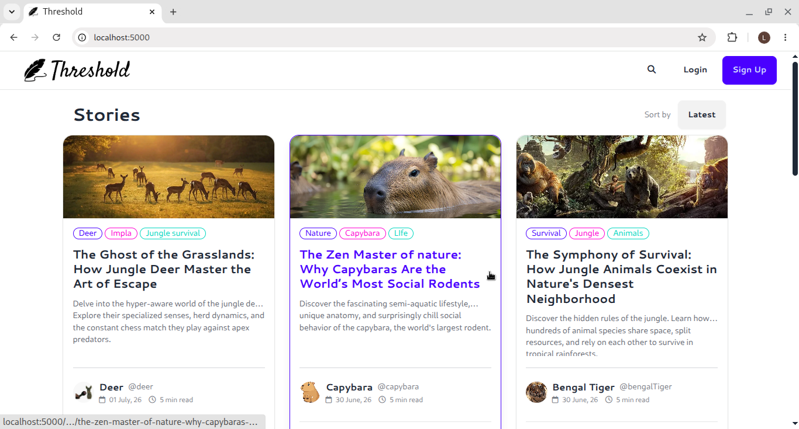
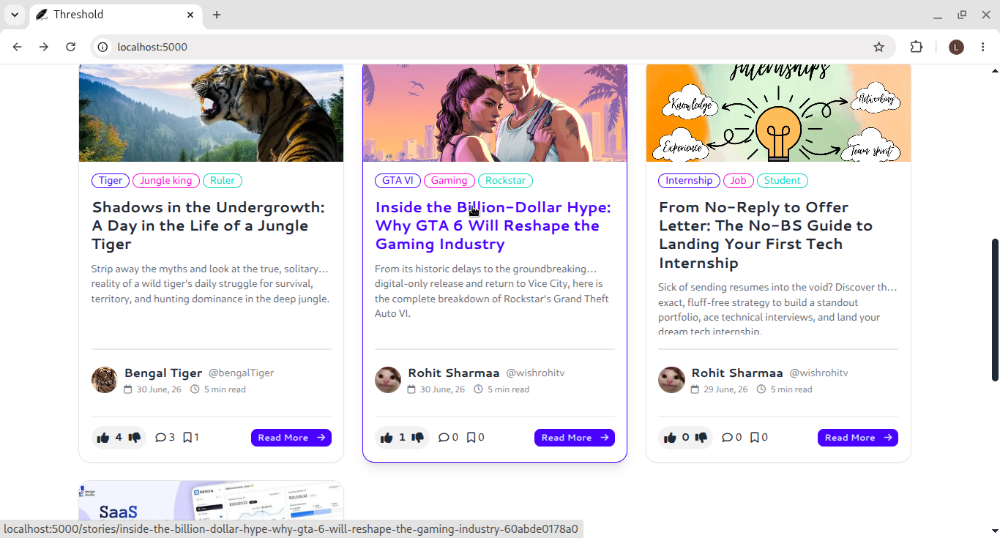
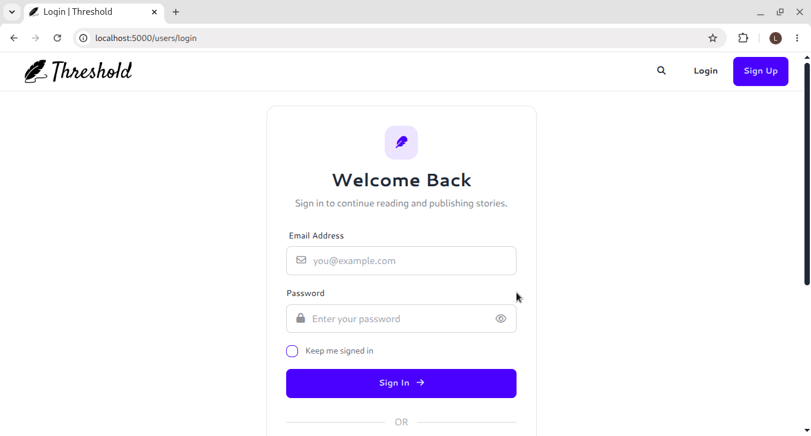
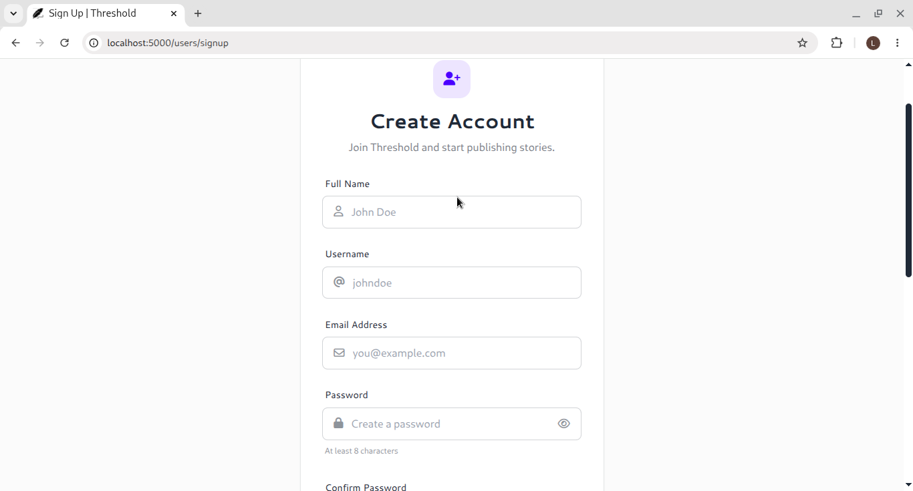
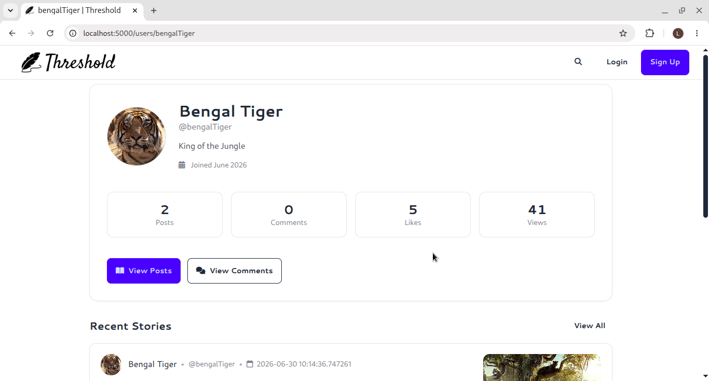

<div align="center">
  
</div>


A blogging platform built with Flask where users can write and share stories, engage through comments, likes, bookmarks, and discover content through search.

## Features

- **User accounts** — sign up with email/password or via Google OAuth. Upload an avatar, set a bio, and link your website.
- **Stories** — create, edit, and delete posts with a banner image, title, description, rich body, and comma-separated tags.
- **Engagement** — like, dislike, bookmark, and comment on stories. Delete your own comments.
- **Profiles** — view any user's posts, comments, and saved stories across three tabs, plus aggregate stats (post count, total likes, total views, comment count).
- **Search** — find stories by title, description, or tags (case-insensitive).
- **Feed sorting** — sort the home feed by latest, oldest, or most popular.
- **SEO-friendly URLs** — story URLs include a human-readable slug auto-generated from the title.
- **Google OAuth** — sign in or auto-register via Google. Accounts created through OAuth do not require a password.

## Screenshots

| | |
|---|---|
|  |  |
|  |  |
|  | |

## Tech Stack

| Layer | Library |
|---|---|
| Framework | Flask 3.1.3 |
| ORM | Flask-SQLAlchemy 3.1.1 / SQLAlchemy 2.0.51 |
| Migrations | Flask-Migrate 4.1.0 / Alembic 1.18.5 |
| Auth | passlib 1.7.4 (SHA-256) + google-auth-oauthlib 1.4.0 |
| Templating | Jinja2 3.1.6 |
| UI | Tailwind CSS + DaisyUI 4 |
| Database | SQLite (dev) / PostgreSQL (prod) — `instance/blog_data.db` |
| Env config | python-dotenv 1.2.2 |

## Project Structure

```
threshold/
├── run.py                      # Entry point
├── settings.py                 # Host, port, debug config
├── requirements.txt
├── client_secret.json          # Google OAuth credentials (not committed)
└── src/
    ├── app.py                  # App factory (Flask, SQLAlchemy, blueprints)
    ├── blueprints/
    │   ├── index/              # Home feed
    │   ├── stories/            # Story CRUD, likes, bookmarks, comments
    │   ├── users/              # Auth, profiles, OAuth, account management
    │   ├── search/             # Full-text story search
    │   ├── about/              # About page
    │   └── admin/              # Admin (in progress)
    ├── migrations/             # Alembic migration scripts
    ├── static/                 # Shared static assets
    ├── templates/              # Base layout, 404 page, macros
    └── utils/
        ├── generate_slug.py            # Slug generation from titles
        ├── context_processors/         # Injects helpers into Jinja2 context
        └── error_handler/              # Custom 404 handler
```

## Getting Started

### Prerequisites

- Python 3.10+
- pip

### Installation

```bash
# Clone the repository
git clone <repo-url>
cd threshold

# Create and activate a virtual environment
python -m venv .venv
source .venv/bin/activate

# Install dependencies
pip install -r requirements.txt
```

### Google OAuth Setup

To enable Google sign-in, create OAuth 2.0 credentials in the [Google Cloud Console](https://console.cloud.google.com/) and download the `client_secret.json` file into the project root. Add `http://localhost:5000/users/oauth/google/callback` as an authorised redirect URI.

If you don't need OAuth, remove the `google_oauth` and `google_oauth_callback` routes from `src/blueprints/users/routes.py` and the related imports.

### Running the App

```bash
python run.py
```

Starts at `http://localhost:5000` by default. Override host and port via environment variables:

```bash
HOST=127.0.0.1 PORT=8080 python run.py
```

### Docker

The image is published on Docker Hub at [wishrohitv/threshold](https://hub.docker.com/repository/docker/wishrohitv/threshold/general). You can pull and run it directly without building locally:

```bash
# Pull the image
docker pull wishrohitv/threshold

# Run the container
docker run -p 3000:3000 wishrohitv/threshold
```

A `Dockerfile` is also included if you prefer to build the image yourself. It uses `python:3.11-slim` and runs the app on port **3000**.

```bash
# Build locally
docker build -t threshold .

# Run the container
docker run -p 3000:3000 threshold
```

The app will be available at `http://localhost:3000`.

Pass environment variables at runtime — never bake secrets into the image:

```bash
docker run -p 3000:3000 \
  -e SECRET_KEY=your-secret \
  -e DATABASE_URL=your-db-url \
  wishrohitv/threshold
```

> Note: `client_secret.json` and `.env` are excluded via `.dockerignore`. Mount them as volumes or inject values via env vars in production.

To pass the Google OAuth credentials file at runtime, mount it as a volume:

```bash
docker run -p 3000:3000 \
  -v /path/to/your/client_secret.json:/src/client_secret.json \
  wishrohitv/threshold
```

The `-v` flag maps your local file into `/src/client_secret.json` inside the container, which matches the `WORKDIR /src` where the app looks for it.

### Database Migrations

```bash
# Apply existing migrations
flask db upgrade

# Create a new migration after model changes
flask db migrate -m "describe the change"
flask db upgrade
```

## Routes

### Index

| Method | Path | Description |
|---|---|---|
| GET | `/` | Home feed (`?sort_by=latest\|old\|popular`) |

### Stories — prefix `/stories`

| Method | Path | Description |
|---|---|---|
| GET/POST | `/<slug>-<uid>` | View story / post a comment |
| GET/POST | `/create` | Create a new story |
| GET/POST | `/<slug>-<uid>/edit` | Edit a story (owner only) |
| POST | `/<id>/delete` | Delete a story (owner only) |
| POST | `/<uid>/<comment_id>/delete` | Delete a comment (owner only) |
| POST | `/<id>/like` | Toggle like |
| POST | `/<id>/dislike` | Toggle dislike |
| POST | `/<id>/bookmark` | Save a story |
| POST | `/<id>/remove-bookmark` | Remove a saved story |
| GET | `/banner/<id>` | Serve story banner image |

### Users — prefix `/users`

| Method | Path | Description |
|---|---|---|
| GET/POST | `/signup` | Register with email and password |
| GET/POST | `/login` | Log in |
| POST | `/logout` | Log out |
| GET | `/<username>` | Public profile (`?tab=post\|comment\|saved`) |
| GET/POST | `/<username>/edit` | Edit your profile |
| GET/POST | `/<username>/change-password` | Change password |
| POST | `/delete` | Delete account |
| GET | `/avatar/<id>` | Serve user avatar image |
| GET | `/oauth/gogole` | Initiate Google OAuth |
| GET | `/oauth/google/callback` | Google OAuth callback |
| GET | `<username>/all-stories` | All stories by user |
| GET | `<username>/all-comments` | All comments by user |
| GET | `<username>/all-saved-stories` | All saved stories by user |

### Search — prefix `/search`

| Method | Path | Description |
|---|---|---|
| GET/POST | `/` | Search stories by title, description, or tags |

### About — prefix `/about`

| Method | Path | Description |
|---|---|---|
| GET | `/` | About page |

## Data Models

### User
| Field | Type | Notes |
|---|---|---|
| `username` | VARCHAR(150) | unique |
| `email` | VARCHAR(150) | unique |
| `name` | String(25) | optional |
| `password` | TEXT | nullable — null for OAuth users |
| `avatar` | LargeBinary | stored as binary |
| `bio` | String(50) | optional |
| `website` | String(100) | optional |
| `provider` | String(8) | `"local"` or `"google"` |
| `role` | String(10) | `"user"` (default) |

### Story
| Field | Type | Notes |
|---|---|---|
| `title` | VARCHAR(150) | |
| `desc` | VARCHAR(200) | short description / subtitle |
| `body` | TEXT | full content |
| `banner` | LargeBinary | cover image |
| `tags` | String(50) | comma-separated |
| `story_uid` | String(18) | unique, used in URLs |
| `views` | Integer | default 0 |
| `last_edited` | DateTime | nullable |

### Supporting Models
- **Like** — `like=1` for like, `like=0` for dislike. One record per user per story, toggled in place.
- **Bookmark** — one record per user per story.
- **Comments** — body up to 200 chars, tied to user and story.
- **BlockedUser** — user blocking relationship (defined, not yet active in routes).

## Code Style Guidelines

This project uses [Ruff](https://docs.astral.sh/ruff/) for both formatting and linting.

### Formatting

Run Ruff before committing:

```bash
# Format all source files
ruff format src/

# Lint and auto-fix where possible
ruff check --fix src/
```

Ruff replaces `autopep8` and `pycodestyle`. If you see those in `requirements.txt` they are legacy and can be ignored in favour of Ruff.

### Python

- Follow [PEP 8](https://peps.python.org/pep-0008/).
- Use 4-space indentation. No tabs.
- Keep lines at or under 88 characters (Ruff's default line length).
- Use f-strings for string interpolation, not `%` or `.format()`.
- All route handler functions must have a single explicit `return` statement at the end. Early returns for auth/guard checks are fine.
- Flash messages must include a category — `"success"`, `"danger"`, or `"warning"`. No bare `flash("message")` calls.
- Use `db.session.execute(db.select(...))` style queries (SQLAlchemy 2.x). Avoid the legacy `Model.query` API.
- Guard all state-mutating routes (POST) with a session check before touching the database.

### Blueprints

- One blueprint per feature area. Keep routes, models, templates, and static assets co-located inside the blueprint folder.
- Blueprint names in `register_blueprint` must match the `Blueprint("name", ...)` string.
- URL prefixes are defined in `app.py`, not in the blueprint itself.

### Templates (Jinja2)

- Extend `base.html` for every page: ``.
- Use `url_for()` for all internal links and `send_file` endpoints — no hardcoded paths.
- Keep logic out of templates. Compute values in the route and pass them in as context.
- Use the `post_card` macro for rendering story cards consistently.

### Models

- Every model must have a `__repr__` method for debugging.
- Model field names use `snake_case`.
- Foreign keys reference the table name string, e.g. `db.ForeignKey("users.id")`.
- Relationships that own child records must include `cascade="all, delete-orphan"`.

### Slug Generation

Slugs are produced by `src/utils/generate_slug.py` and follow the same pattern used by Medium — special characters and spaces are replaced with hyphens, consecutive hyphens are collapsed, and the result is lowercased. Example:

```
"Hello, World! My Story" → "hello-world-my-story"
```

The `story_uid` is then appended to the slug in the URL to ensure uniqueness:

```
/stories/hello-world-my-story-<story_uid>
```

When adding new URL-generating logic, import and reuse `generate_slug_from_title` — do not write a second implementation.
